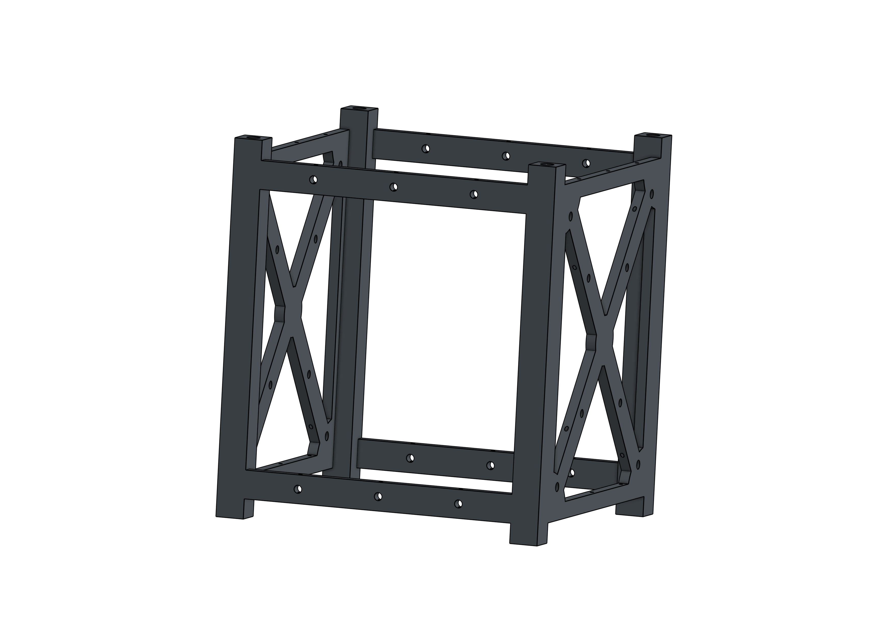
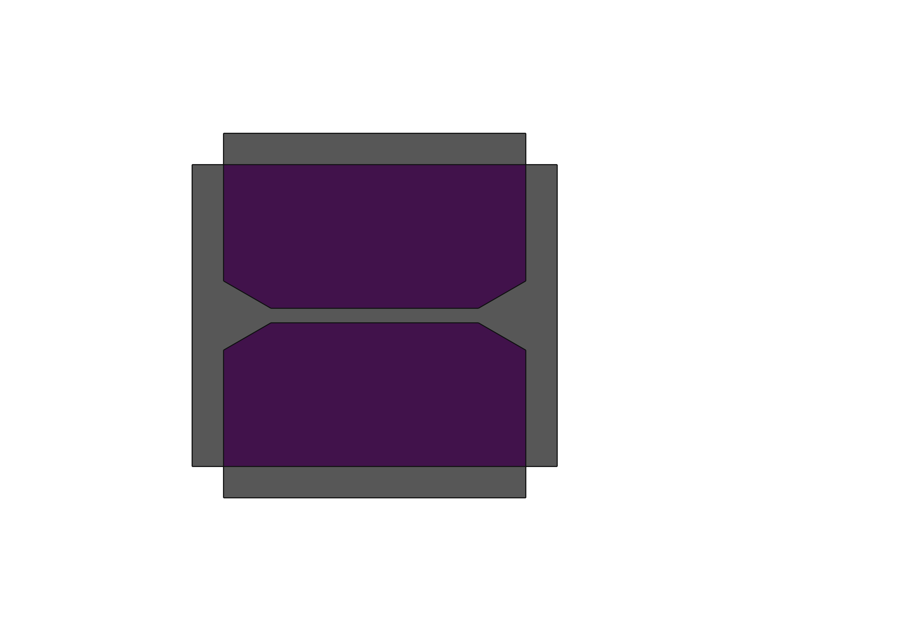
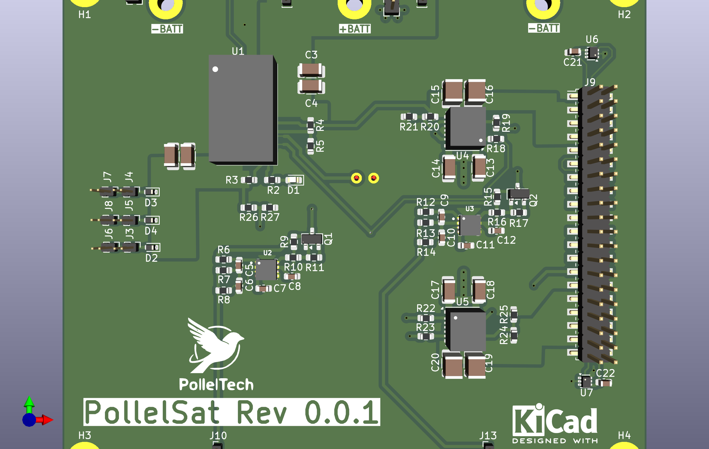
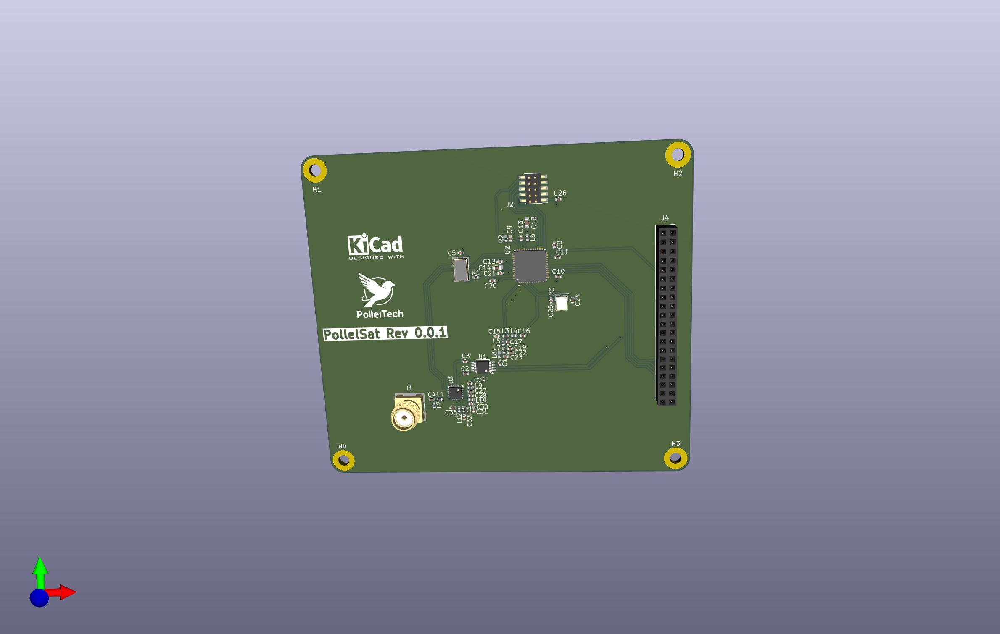

# 


## 📘 Description

Ce projet a pour objectif la conception et la réalisation complète d’un CubeSat au format **1U**.
Il couvre l’ensemble du cycle de développement :

* **Conception 3D** de la structure
* **Développement hardware** (cartes, alimentation, capteurs, communication)
* **Développement software** embarqué
* Intégration, tests et documentation

L’objectif est de créer une plateforme expérimentale ouverte, évolutive et accessible.

---

## 🛰️ Objectifs du projet

* Développer une architecture CubeSat fonctionnelle en open-source
* Expérimenter l’ingénierie spatiale à petite échelle
* Créer un modèle reproductible pour étudiants et makers
* Documenter toutes les étapes : mécanique, électronique, firmware, protocoles…

---

## 🧩 Structure du dépôt

```
/3D/              → Fichiers de conception mécanique (CAD)
/hardware/        → Schémas, PCB, BOM
/software/        → Code embarqué, drivers, protocoles
/docs/            → Documentation technique
/tests/           → Scripts et procédures de tests
```

---

## 🛠️ Technologies utilisées

### Conception 3D
La conception mécanique du CubeSat 1U est entièrement réalisée sur **Onshape**. Dans un premier temps, il est nécessaire de créer le cadre qui respecte les contraintes du CubeSat (voir la [spécification CubeSat](docs/CubeSatSpecification.pdf)).
# 

### 🔧 Hardware

* Microcontrôleur **STM32H7** et **Raspberry PI CM4**
* Capteurs IMU, caméras et modules de télécommunication
* Systèmes d’alimentation **Battery** + **PV**
   | Composant       | Png | Schéma      |
  |:-----------|:---:|------------:|
  |  EPS     |   | [Kicad_sch](hardware/EPS/eps.pdf) |
  |  Battery     |   | [Kicad_sch](hardware/BatteryConnector.pdf) |

* Systeme Radio **CC1312R1** à 915 MHz
  | Composant       | Png | Schéma      |
  |:-----------|:---:|------------:|
  |  Radio   |   | [Kicad_sch](hardware/RADIO/radio.pdf) |

### 💻 Software

* Firmware en C/C++
* Outils de simulation
* Protocoles de communication embarqués

---

## 📝 Roadmap

* [ ] Conception complète mécanique 1U
* [ ] Prototype des premiers PCB
* [ ] Développement firmware de base
* [ ] Système de télécommunication minimal
* [ ] Tests thermiques & vibration

---

## 🤝 Contribution

Les contributions sont les bienvenues !
Merci de suivre les pull requests et issues du dépôt.

---

## 📜 Licence

**GNU GPL v3**
Ce projet est open-source et distribué sous licence GNU GPL version 3.
Vous êtes libre de l’utiliser, le modifier et le redistribuer tant que la licence reste préservée.
